# ArtBeauty AI Assistants 
Проект создания ИИ-ассистентов для салона красоты ArtBeauty.

## Описание проекта
ArtBeauty AI Assistants — это no-code проект, демонстрирующий работу двух бот-ассистентов для салона красоты ArtBeauty.  
Проект автоматизирует консультирование клиентов и приём заявок, которые сразу записываются в Google-таблицу.  
Ассистенты реализованы с использованием Cursor AI и OpenAI, обеспечивая быстрый и удобный сервис для клиентов и сотрудников салона.

## Используемые инструменты
- 🤖 Telegram, сайт (Tilda) для коммуникации
- 🛠️ Cursor AI и AI-агент OpenAI для настройки логики  
- 📊 Google-таблица для хранения заявок  

## Скриншоты

### Telegram-бот  
**Быстрая запись**  
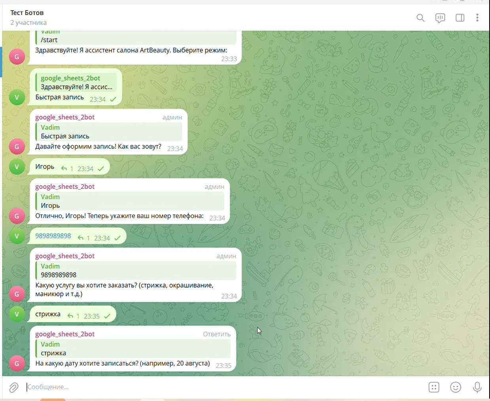  
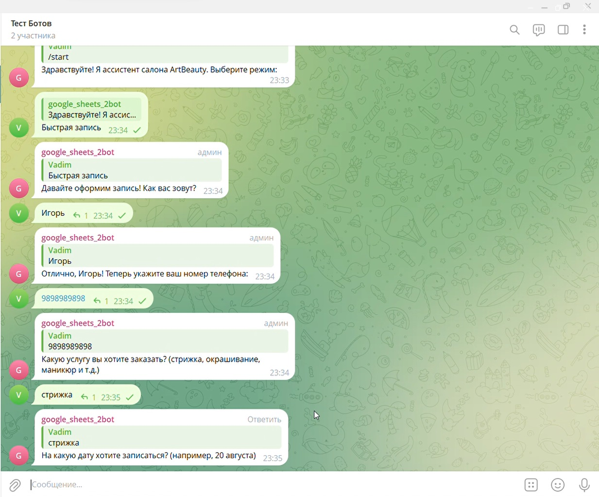  
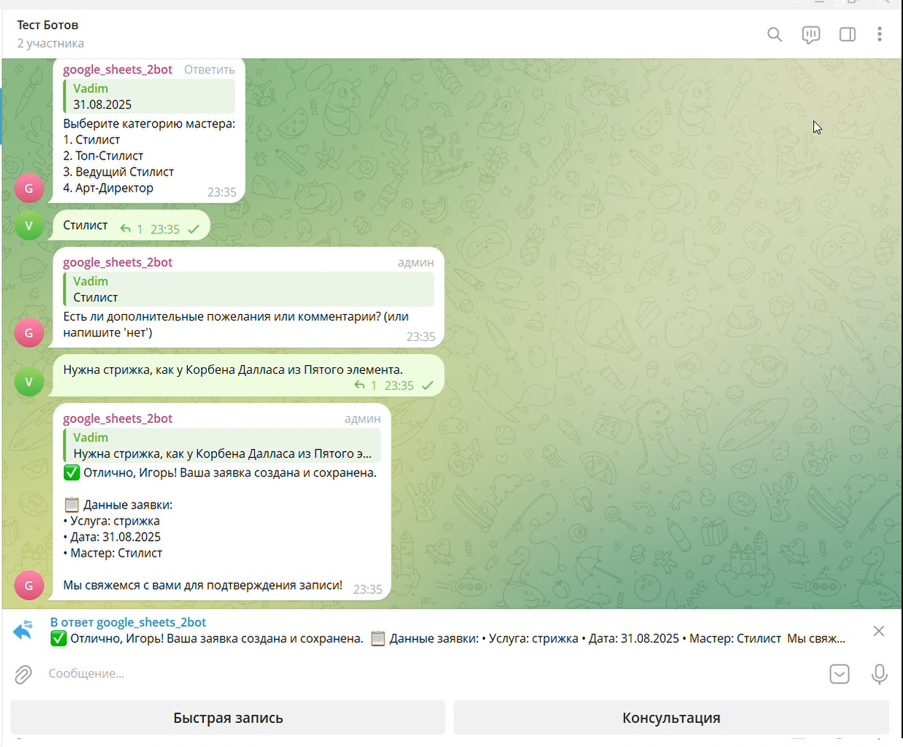  

**Консультация**  
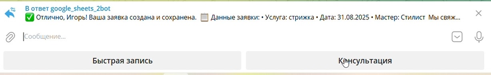  
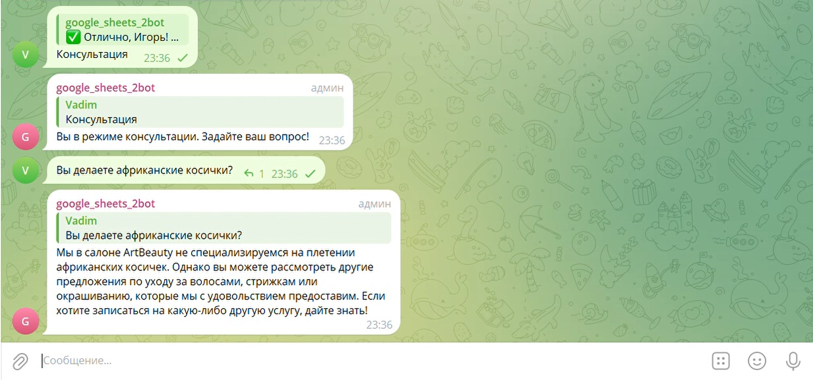  

### Веб-ассистент (Tilda)  
**Быстрая запись**  
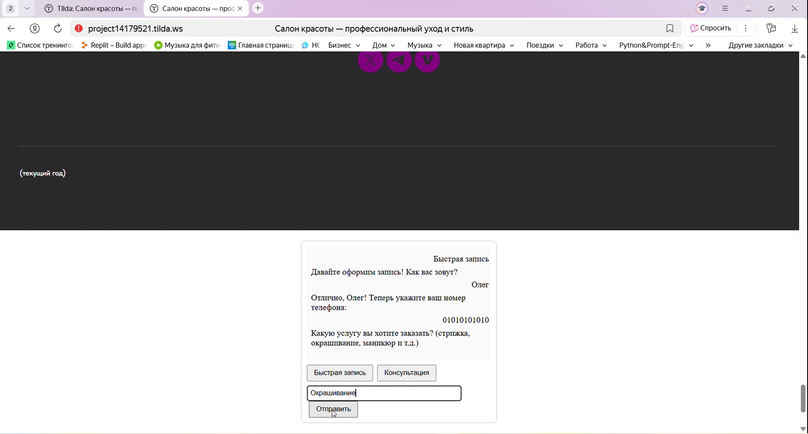  
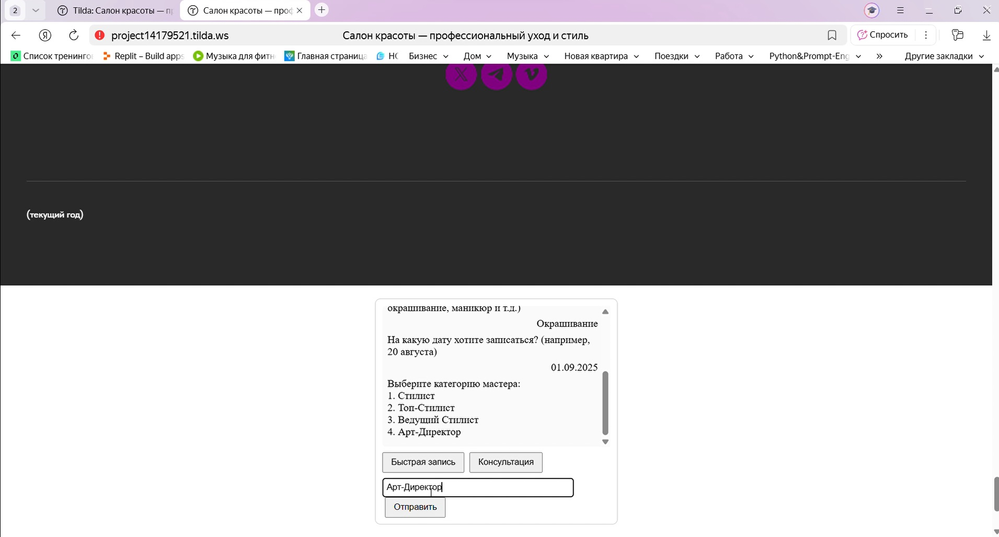  
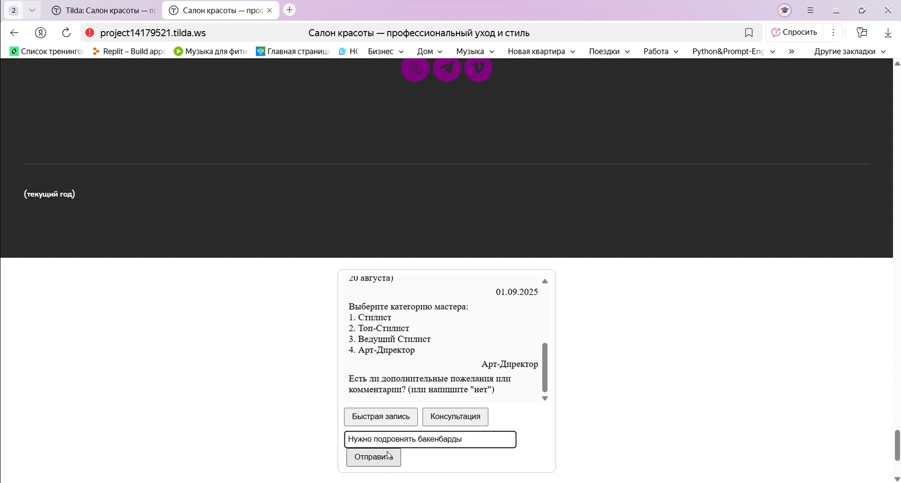  
  

**Консультация**  
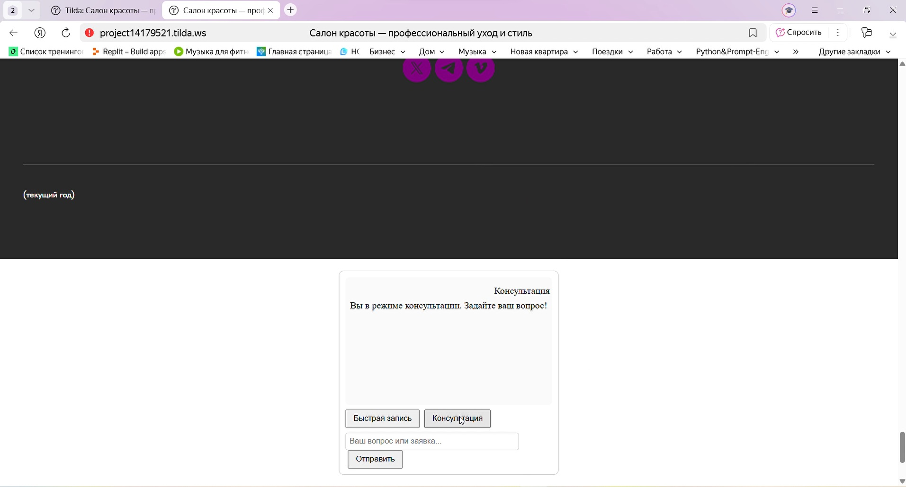  
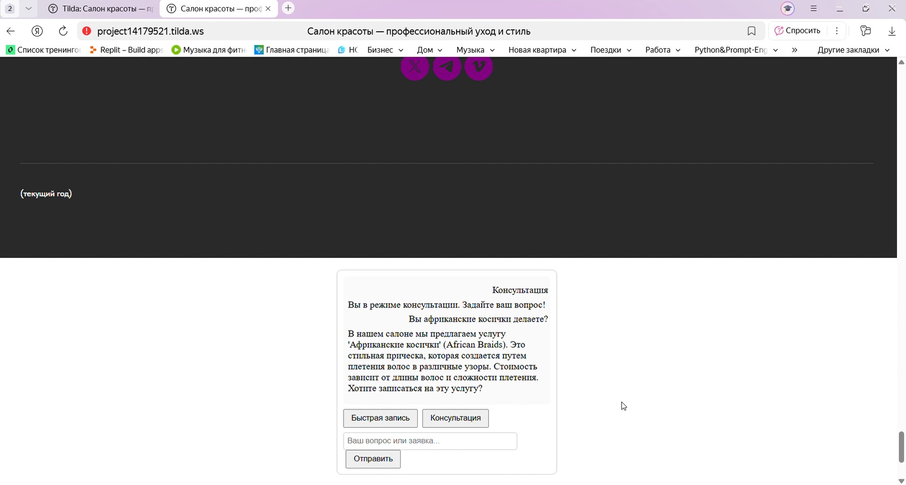  

### Google Sheet  
**Заявки ИИ-ассистента**  
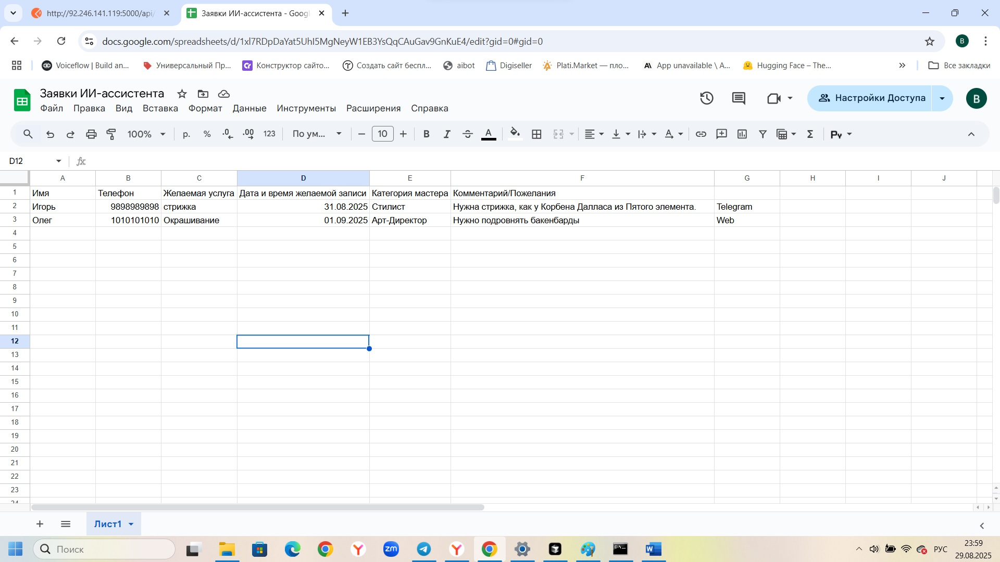

## Перейти к боту
- Telegram-бот: [t.me/bot_test4_4](https://t.me/bot_test4_4)  
- Сайт: [ArtBeauty](http://project14179521.tilda.ws)

## Контакты
- Telegram: [@мой_ник](https://t.me/твой_ник)  
- HH.ru: [ссылка на резюме]

